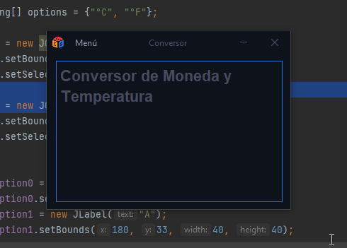

## Challenge Convertidor de Moneda y Temperatura

### Objetivo

- El objetivo era la creación de un convertidor de moneda, pero al final se decidió que fuera de moneda y temperatura.

### Descripción

- Soporta 5 monedas:
    - Peso Mexicano
    - Dólar
    - Euro
    - Libra
    - Yen
    - Won

- Soporta 2 temperaturas:
    - Celsius
    - Fahrenheit

Está hecho en Java, con la librería Swing.

### Validaciones

- Se añadieron validaciones para que no se ingresen letras en los campos de númeoros.

- Se añadieron validaciones para valores vacios.

### Ejecutable

- Se puede descargar el ejecutable .jar para su explotación aquí [release](https://github.com/Drako9159/Convertidor/releases/tag/1.0)

Este proyecto fue realizado para el Challenge de ALURA by Oracle Dec 2022. ✔

- Twitter [@drako9159](https://twitter.com/Drako9159)
- Twitter [@Web](https://www.drako.icu)
- Linkedin [Antonio Jaramillo](https://www.linkedin.com/in/antonio-jaramillo-099a77250)